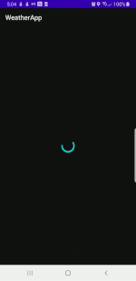
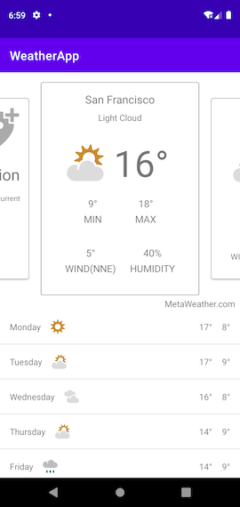
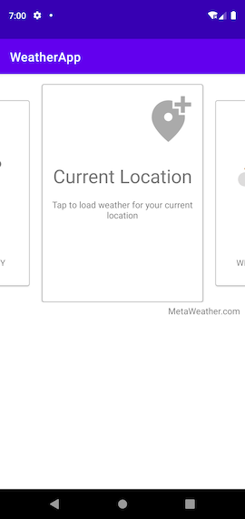

# Weather App

## Introduction
Weather App is a sample that implements the WeatherView library for displaying weather data.

## WeatherView library
WeatherView library provides a fragment that can be included to your application for displaying the Weather Data of major cities.

## Usage
The WeatherView is created by:
```java
WeatherViewFragment.newInstance();  
```
Once created, add it to an existing activity or fragment.

```java
class MainActivity {
    getSupportFragmentManager()
                        .beginTransaction()
                        .replace(R.id.container, WeatherViewFragment.newInstance())
                        .commitNow();
}
```

On adding the fragment, the fragment will perform the fetching of necessary data and displays the UI.
The UI displays:
1. A carousel view of Weather data for major cities around the world.
2. For each city, the current weather information as well as the forecast for the next 5 days.
3. User can swipe through the cards to see the weather forecast for each city.
4. If the user wishes to see the weather info for his/her current location, then user can tap on the 'My Location' card in the carousel.
5. On tapping, the current location will be fetched and the weather info for the location will be displayed.

WeatherView library uses the Card-Carousel and MyLocation libraries to implement the features.

### Coding Style
1. Presentation - Android MVVM with LiveData
2. Domain - UseCases
3. Data - Repository Design pattern

### Technologies
1. Android Architecture components
2. RxJava
3. Retrofit, OkHTTP, Gson
4. Dagger2
5. Junit, Mockito & MockWebServer

## Card-Carousel library
A RecyclerView based implementation of a Carousel like view. The library provides a custom view that can be included to a layout in your project or can be used programatically.

### Usage
1. Include the CarouselView to the layout.
```xml
<com.androidnerds.cardcarousel.CarouselView
            android:id="@+id/carouselView"
            android:layout_width="0dp"
            android:layout_height="300dp"/>
```
2. Define the Adapter for the CarouselView similar to how we create ViewHolders and Adapters for a RecyclerView.
3. Assign the adapter to the CarouselView.
4. To receive callbacks when an item in the CarouselView comes to the middle(selected), then implement the OnCarouselItemSelectedListener as below:
```java
    carouselView.setItemSelectedListener(position -> {});
```

## MyLocation library
This is a library that implements the FusedLocationProviderClient and performs the retreiving the location of the device. The library provides the location
as a datasource.

### Usage
Use the DeviceLocationDataSource class that provides the location info of the device via a Flowable<DeviceLocation>.
If you wish to receive location updates, then create an instance of the DeviceLocationDataSource class and subscribe to the Flowable<DeviceLocation> provided by 
calling the getDeviceLocation() method.

## Screenshots





